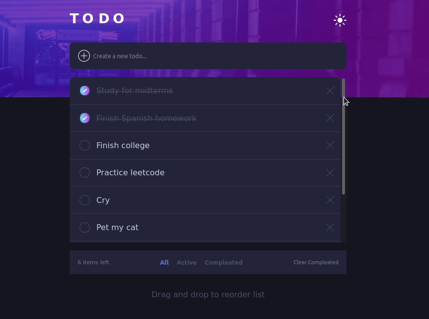

<h1 align="center">Hi 👋, I'm Hector</h1>
<h3 align="center">A passionate frontend developer from Texas</h3>

- 🌱 I’m currently learning **the MERN stack and TypeScript!**

- 💬 Ask me about **React, Javascript, or front-end development.**

- 📫 How to reach me **jdbjfl@gmail.com**

<h3 align="left">Connect with me:</h3>

<h3 align="left">Languages and Tools:</h3>

                     

<h1 align="center">Projects</h1>
<table bordercolor="#66b2b2">
  <tr>
    <td width="50%" valign="top">
      <h3 align="center">Todo App</h3>
       
        
       
        

  
  
      

        
Responsive Todo app built with React, Redux, and vanilla CSS.

    </td>
    <td width="50%" valign="top">
      <h3 align="center">"That's What She Said"</h3>
         
        
         
        

          
  
  
      

        
Be able to (somewhat) accuratly see your location based on your IP address. 

    </td>
  </tr>
</table>

  

